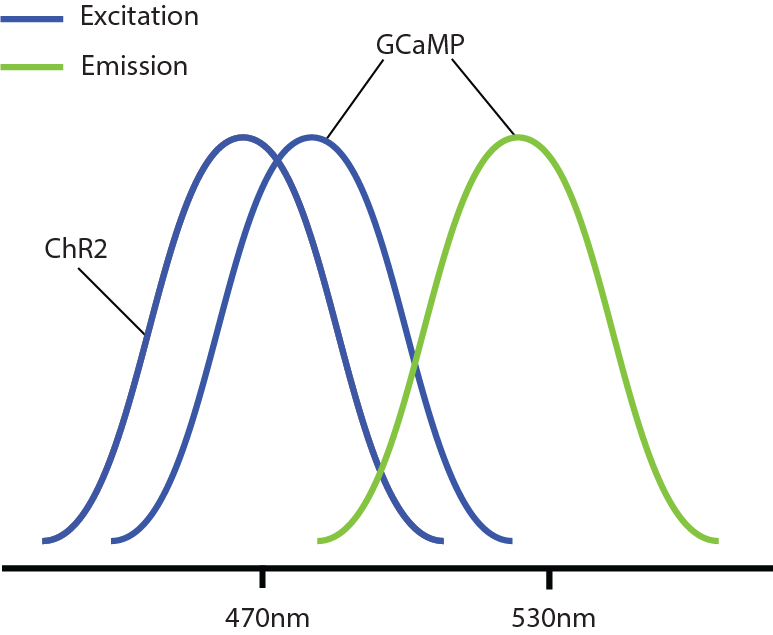

========================================
Pipeline to process scans
========================================
Explanation of our pipeline to process scans and stacks. `Code <https://github.com/cajal/pipeline>`_.

Primer on calcium imaging
=======================================
Genetically encoded calcium indicators
-----------------------------------------
Mice are genetically modified to express a fluorescent protein that will emit light (fluoresce) at a specific wavelength (green for GCAMP proteins) when it binds to calcium ions and is excited by light at a specific wavelength (blue-ish for GCAMP); because electrical spikes in neurons are produced by a surge of calcium inside the neuron this protein will "light up" when the cell spikes (and if it is excited at the right wavelength range) allowing us to "see" cells firing. Different calcium indicators have different excitation and emission ranges, target neurons, response functions, SNR, etc. In general, we use a GCAMP6s expressed in pyramidal cells (90% of neurons in cortex) which is fast and bright enough for most our use cases.

*Aside:* Calcium indicators (GECIs) measure calcium concentration in the cells, calcium dynamics are slower than spike activity. Voltage indicators (GEVIs) work similarly except they directly measure voltage changes in the membrane (though SNR is usually lower and one can only record a small number of cells at a time, record as of 2020 is 13 in the same FOV vs 10K or so for calcium imaging). 

Resonant scanning
-------------------------------------
The microscope moves a laser (tuned to the right excitation wavelength) in a sweeping motion around the desired FOV and records the amount of response with a PMT (tuned to the right emission wavelength); i.e., we record the amount of response a single pixel at a time starting at the top left corner and scanning line by line until it gets to the last pixel of the last line of the FOV (and then it moves back to the top left corner for the next frame). This back-and-forth motion is done using a mirror that always vibrates at the same speed meaning that scanning a (horizontally) thin FOV will take the same time as a very wide one but the laser will spend more time over each pixel which results in better SNR but could also burn the tissue; it also means that the time it takes to scan a FOV depends only on the number of lines/height of it and not its widht. Bidirectional scanning records one line when the laser moves from left-to-right and the next one when the laser moves back from right-to-left while unidirectional scanning only records when the laser moves from left-to-right. When we want to record at a different depth or a different position at the same depth, the objective lens (see Fig.) is moved up or down and the process is repeated. The time it takes to move from one depth to the next is usually longer than the time it takes to move from one FOV to anoter at the same depth which is longer than the time it takes to move from the bottom of the FOV to the top of the FOV; lasers get shuttered during the time it takes to move. ScanImage (Matlab library developed by Vitrio) takes care of managing all of this.

.. image:: images/two_photon.jpg

*Aside:* We use two photon microscopes, meaning we in fact need two lasers to be pointing to the same pixel before the fluorescent protein receives enough excitation to emit light but the mechanics are the same.

Scan
-------------------------------------------
A scan is a recording of fluorescent activity over time. A 2-dimensional FOV (a "field") is recorded at different depths for a number of frames. Our resonant scans can record the same field of view at different depths but the mesoscope scan can record more than one FOV at different depths and even different sized FOVs at different depths (though we rarely use this type of setup). Both scans can record more than one channel  (by using two PMTs tuned to different wavelengths).

.. figure:: images/field.png
  :figclass: align-center
  
  Snapshot of a scan with cell fluorescent activity recorded in the "green" channel overlaid on top of vessel fluorescence in the "red" channel. This mouse expressed two fluorophores: one in pyramidal cells and one in vessels. Colors are added for visualization, original recording happens individually in each channel.

Stack
---------------------------------------
We call a stack a specific scan configuration where we record a small number of frames (10-100) at very short depths (1-5 microns) and later take an average over frames and use this as sa 3-d snapshot of the tissue. It is useful to see how the tissue has changed from one day to the other or to later register 2-d scans into it and find out exactly where some cell is for instance.

Pipeline
==========================
Scans are recorded using 2pMaster (labView stimulus program) which takes care of running the stimululs, making sure cameras and behavior responses are correctly running and saving everythin in disk. It inserts an entry for the scans in experiment.Scan with some info about the scan (usually information given by the experimenter like fluorophore, brain area, depth in cortex, etc. as well as the location of the scan and beahvior files in disk). It also saves the rig used to record the scan which lets us now if it is one of our mesoscopes (2P4, 2P6) or a normal resonant scan. 

After a scan is recorded, the experimenter will put the scan in experiment.AutoProcessing which marks the scan for processing through our pipeline. This is usually done via a pipeline webpage in shikigami. For stacks, the experimenter needs to fill experiment.Stack (and importantly experiment.Stack.Filename) and stack.CorrectionChannel with the channel be used for corrections.

Pupil camera and treadmill are processed in the pupil and treadmill pipeline. We use a different pipeline for resonant (reso) vs mesoscope (meso) scans but they pretty much mirror each other (tables and processing) so I'll focus on the meso pipeline. Stacks are processed though another pipeline (stack) which I will describe below.

stimulus
------------------------------
stimulus.BehaviorSync: 
    Records the time of each scan depth in behavior clock.
stimulus.Sync: 
    Records the time of each scan depth in stimulus clock.

See stimulus_sync docs for how the syncing works and extra details

Possible issues
~~~~~~~~~~~~~~~~~~~~~~~
* "PipelineException: Could not find any flips in the photodiode signal" 
    Photodiode signal is all noise. Fix: if some cable was not plugged or the signal was not recorded there is no way to recover this.
* "PipelineException: Frame time period is irregular" 
    Recorded frames from frameSync signal are not regular; i.e., some frames last longer than others. This should not happen and it signals the stimulus computer somehow getting hanged. Fix: check why the irregularity happens, if it is acceptable, it can be ignored as a warning.
* "PipelineException: Some photodiode flips come from a different scan" 
    flips decoded from the photodiode signal have numbers that are not recorded in stimulus.Trial. This means that somehow a flip from a different scan got shown here and should in general not happen. Often it is only the very first photodiode flip that somehow has a number that is not recorded in stimulus.Trial. Fix: if willing to ignore, delete the wrong flips (usually only the first one) from photodiode_flip_indices, photodiode_flip_numbers and photodiode_flip_times in stimulus.Sync._sync.

pupil
----------------
pupil.Eye: 
    Records the time of each video frame in behavior clock.
pupil.Tracking: 
    Tracks the pupil either manually (tracking_method 1) or with deeplabcut (tracking method 2)
pupil.FittedPupil: 
    Fits a circle (and an ellipse) to the pupil from each tracked frame.

treadmill
----------------------
Treadmill records absolute position in  a "counter", when the treadmill is moved forward/backward this counter increases/decreases. Table treadmill.Treadmill contains the raw recorded treadmill counts, the timepoint of each tradmill count (in behavior clock) and the instantaneous treadmill velocity (cm/sec) at each recorded step; experiment.TreadmillSpecs records the diameter of the wheel used and the diameter of it, we use those to transform from counts/secs to cm/secs.

Reading scans
-------------------------
We developed a library (`scanreader <https://github.com/atlab/scanreader>`_) for reading scans.
ScanImage records scans as tiff multi-page stacks (which are usually subdivided in more than one .tiff file); each depth of scanning is recorded in a tiff page so if you record 3 depths for 5 frames in 1 channel you would have 15 pages: 3 depths for frame 1, followed by 3 depths of frame two and so on; if you record two channels the tiff will have 30 pages (each channel is interleaved). Each page also records a header with some scanning information, like depth, duration of scanning, number of frame, etc.

This also holds for mesoscope scans, where you can record more than one field per depth; in this case fields are tiled on top of each other during saving; i.e., if depth 1 has two fields the image for that depth will have all the lines for field 1 + some blank space + field 2. The number of lines in the blank space are the lines recorded while the laser moved from the end of field 1 to the start of field 2 and can be calculated from the header.

Different microscopes, different scanning configurations, and different ScanImage versions save information in a slightly different way. Scanreader abstracts this away and lets you access the scan essentially as a 5-d numpy arrays (num_fields x height x width x num_channels x num_frames); if fields don't have the same height/widht you can only access one field at a time. Loading is done lazily (i.e. data is only read form disk when it is needed). It also allows to read information, like num_frames or height or time delays in a standardized way. Pipeline relies in this library when reading scans and stacks.

Possible issues
~~~~~~~~~~~~~~~~~~~~~~~~~~~
*  ScanImageVersionError: Sorry, ScanImage version 5.7 is not supported
    scanreader is not forwards compatible, any time that a new version of ScanImage is used to record a scan there is a chance that they changed the way they record some data or header information so when trying to read scans with a new ScanImage version, scanreader throws a not supported error.
    ScanImage has done a better job recently of keeping new versions backwards compatible, if that is the case, you can check previous scanreader PRs adding a new scanimage version to scanreader for a guide of how to add a new version but use the same processing as older versions for it (e.g., https://github.com/atlab/scanreader/pull/10/files)
* tifffile issues
    scanreader relies on tifffile.py to do the actual tiff file reading, updates to this library could break some functionality of scanreader. 

reso/meso
---------------------
The goal of the scan "pipeline" is to go from recorded scan (num_fields x height x widht x num_channels x num_frames) to a set of cells with its (derived) electrical activity (num_cells x num_frames).

We achieve this in many steps:

* ScanInfo
    Records some information about the scan from scanreader (which in the back reads it from the ScanImage header)
* (Optional) Quality 
    Creates some quality images from the raw scan like summary frames over time (averages across times) and mean intensity over time or mean contrast over time and so on.
* (Manual) CorrectionChannel
    If the scan has more than one channel, the experimenter will need to make an entry in this table (possibly via shikigami) to choose which channel to use for raster and motion correction.
* RasterCorrection
    If the scan was recorded bidirectionally, sometimes the odd lines (recorded when the laser was moving from left-to-right) may be a bit shifted with respect to the even lines (recording when the scan was moving from right-to-left). In this step we take 2000 frames from the middle of the scan, average them, create one image from the odd lines and one image from the even lines, and then cross-correlate this images to get an estimate of raster shift that is recorded in this table. This problem is less common today than at some point in the past, most fields return a zero shift.
* MotionCorrection
    Brain could move rapidly or drif slowly during scanning. This step aims to correct this motion. We take an average of the central 2000 frames as template, discard 10% of pixels near the edges of the FOV (to avoid some effects that happen there) and cross-correlate each recorded frame to this template to find the shifts in x, y needed to make each frame match this template. Outliers (motion of more than 20 frames in x or y) are detected and corrected by interpolating between them. This is rigid motion correction.
* (Optional) SummaryImages 
    Scan is corrected and some reference images such as the average image (across frames) or the "correlation" image (image that takes the correlation of each pixel with the 8 pixels around it) are saved.
* (Manual) SegmentationTask
    This manual table records the compartment (soma vs dendrite vs bouton) and the method of segmentation for each field that needs to be segmented. It is usually filled via shikigami by marking the auto-segment checkbox which inserts all fields as having somas that need to be segmented with segmentation_method = 6 (CNMF with the latest parameters). It has a fill() method that can be used to fill scans with default parameters.
* Segmentation
    CNMF segmentation of a field. We use Caiman to run CNMF segmentation, we asjust parameters slightly different depending of the target compartment and run a slighlty modified CNMF loop (see caiman_interface.segment_masks for details). It records the masks of all segmented cells as a part table.
    
    This table also records manual segmentations; if the segmentation method selected in SegmentationTak is manual it will open a GUI that allows people to segment stuff manually. This currently only works in Matlab; i.e., if you want to insert a manual segmentation you need to call populate in the Segmentation table of Matlab (this will insert the line in SegmentationTask and later insert the masks in Segmentation.Mask).
* Fluorescence
    This records the raw fluorescence traces for each segmented mask. If segmentation was done with CNMF, the populate of Segmentation will also insert this fluorescence traces (as they are also an output of the segmentation), otherwise it will load the scan, the masks and take a weighted average of the mask at each frame to get the fluorescence traces (which is what happens for manual segmentations, for instance). For CNMF, fluorescence traces are the estimated traces for the cell in question: i.e., it is the fluorescence trace after substracting any activity from other overlapping masks and any background/neuropil activity.
* ScanSet
    Scans are processed field by field (usually in parallel) which results in neurons segmented in each filed being assigned a 'mask_id' that is unique per field but not across the full scan. In this table we assign a unit_id that is unique across the entire scan (i.e., is field 1 had masks 1-100, and field 2 1-150, unit_ids will go from 1-250). It also records some information per unit: x, y position in the field or recording delay from start of frame (this records in ms the time it took for the laser to travel from the start of the volume to each cell, it could be significant if the framerate of the scan is slow).
* Activity 
    This takes each fluorescence trace and deconvolves the electrical activity from it. In CNMF (the current default method), for each trace, the two coefficients of an autoregressive model of order 2 are estimated from the trace to create an impulse response function, and later the spike trace is estimated as the trace that when convolved with the impulse response function gives the closest match to the recorded fluorescence trace; additionally a sparsity constrain is added to the spike trace. This spike trace should be thought of as spike rate.

.. image:: images/deconv_nmf.jpg

* ScanDone
    This table is populated when all fields have gone through deconvolution. It signals the entire scan has been processed.

Other tables that are not part of the main pipeline but are sometimes used:

* StackCoordinates
    Computes the stack coordinates for each cell in a field (using the affine registration from the stack pipeline).
* AreaMembership
    Assign a brain area to each cell in a field using a brain area map from the anatomy pipeline and the registration of that map (well, the scan from where that map was produced) to some stack that also has the field registered to it. This avoids having to do a manual registration when doing the anatomy brain area assignments.
* Func2StructMatching
    Assign each functional mask to a mask segmented using the stack (see stack.Segmentation and stack.FieldSegmentation below).

Possible issues
~~~~~~~~~~~~~~~~~~~~~~~~~~~
* (ScanInfo) "ValueError: attempt to get argmin of an empty sequence"
    We use the objective lens recorded in experiment.Scan to determine how big the FOV of the scan is in microns; experiment.Lens records for each lens in each particular rig the size in microns corresponding to 512 x 512 pixels (or some other standard px size). When they use a lens that does not have an entry in experiment.Lens for that particular rig (for instance when they input by mistake lens=meso for rigs that are not the mesoscope); this error will happen because it restricts the table, fetches an empty list and then tries to compute the minimum at some point.
    
    Fix: change to the right lens in experiment.Scan or if it is a new lens that has not been measured in that rig, ask someone to make that measure and record it in the experiment.Lens table (otherwise we have no way to estimate the size in microns of the FOV which we need for segmentation).

* (ScanInfo) "PathnameError: Pathname(s) /mnt/....*.tif do not match any files in disk." 
    Usually means the scans where not correctly copied from the stimulus computer to its final destination in a /mnt/scratch storage. 
    
    Fix: Copy the files to the right place (or check whether filenames are somehow wrong).

* (ScanInfo) "IntegrityError: (1452, 'Cannot add or update a child row: a foreign key constraint fails (`pipeline_reso`.`_scan_info__field`, CONSTRAINT `_scan_info__field_ibfk_2` FOREIGN KEY (`field`) REFERENCES `pipeline_shared`.`#field` (`field`) ON UPDATE CASCADE)')" 
    This happens if trying to process a scan with more than 24 fields; it usually means that somebody put a stack in experiment.AutoProcessing. 
    
    Fix: delete the stack key from experiment.AutoProcessing and put it in stack.CorrectionChannel (as described above).

* (ScanInfo) "DataError: (1264, "Out of range value for column 'nfields' at row 1")"
    Too many fields for a scan, this is usually when trying to populate a stack as a scan.
    
    Fix: delete the key from expeirment.Autoprocessing and add it in stack.CorrectionChannel.

* (ScanInfo) "IntegrityError: (1048, "Column 'z' cannot be null")" 
    This will hapen if the scan did not record the depth correctly (it usually records NaNs). Pre-fix: Verify why was the depth not correctly recorded during scanning (maybe motor was disconnected or some new configuration that has not been used before and scanreader can't deal with. 
    
    Fix: If wanting to process the scan anyway you would have to override the code to insert some manual zs for the fields (probably ask the experimenter what are the expected zs for each field).

* (Segmentation) "ValueError: cannot reshape array of size 0 into shape (0)" 
    Usually means nothing got segmented. It happens when people try to segment fields that are all noise or have no cells. 
    
    Fix: Delete the field from SegmentationTask.

* (ScanSet) "DataError: (1264, "Out of range value for column 'um_z' at row 1")"
    We try to record depths (zs) with respect to the surface of the cortex (surface is zero and z increases as you go deeper); for that experimenters record in experiment.Scan the surface of the depth in motor coordinates (i.e., record what the motor reads at cortex and record that; though, more often they go to the surface, zero the motor values there and record zero in experiment.Scan). If this number is misreported (usually if they put zero but do not zero the motor at cortex), sometimes the estimated zs can be outside the normal range (~[-50, 700]); this error happens because the estimated um_z are so off that the datatype overflows. 
    
    Fix: change the surf_depth in experiment.Scan to be the right one (this is usually done by asking what was the expected depth of the field and then subtracting the field depth recorded by scanimage scan.field_depths from it and inserting that as surf_depth); then fix the ScanInfo zs to be the right ones given the new surf_z (or repopulate it).

* (Activity) LockoutError
    Lockout errors commonly happen in meso.Activity. This may be because each segmented trace is inserted one by one (rather than putting them all into a single list and d one insert per make). 
    
    Fix: delete the errored job and let it redo it.

* (Activity) DuplicateError 
    This (I believe) happens when two minions reserve the same job and then when the second one finishes it complains that that key has already been inserted. 
    
    Fix: delete the errored job (nothing needs to be redone because one minion already finished).

* (Activity) "IntegrityError: (1452, 'Cannot add or update a child row: a foreign key constraint fails (`pipeline_reso`.`__activity__trace`, CONSTRAINT `__activity__trace_ibfk_3` FOREIGN KEY (`animal_id`, `session`, `scan_idx`, `pipe_version`, `field`, `channel`, `segmentation_method`, `spike_me`)')"
    Not sure why this happens but the fix is to delete the job and let it redo it.

fuse
------------------------
When downstream tables will deal with both reso and meso scans we sometimes need a single point table (for instance to use as primary key). Pipeline fuse has some tables (MotionCorrection, ScanSet, Activity and ScanDone) that serve this purpose. Populating those tables just inserts all keys from reso and meso that have been processed.

stack
-----------------
This does some similar processing to reso/meso but for stack. Essentially correct motion, stitch fields that overlap and correct slice-to-slice motion to create a 3-d view of the brain.

* StackInfo
    Records some basic information for the stack and for each ROI individually. An ROI is a single 3-d column of recording, resonant stacks usually have a single ROI but meso stacks have two or three ROIS placed next to each other (with some overlap) to cover a bigger FOV. Each ROI could theoretically have different dimensions and different number of depths and so on. The pipeline was even develped to deal with stacks that are formed by more than one recorded stack (i.e. stacks that come from different files) but this is never used (and should probably be dropped as it only adds complexity for no value).
* (Optional) Quality
    Creates average intensity (or contrast) for each ROI (a num_depths x num_frames image) and some summary frames per ROI (for each ROI take the average of ROI at the firstr depth, last depth and 6 depths in between).
* (Manual) CorrectionChannel
    This records which channel to use for corrections. This works as an "Autoprocessing" for stacks; any stacks put here will be processed through the entire stack pipeline.
* RasterCorrections
    Similar to raster correction in reso/meso, it tries to find how much to shift even lines (with respect to odd lines) to correct for any systematic errors introduced during scanning. The main difference is that here the raster params are computed per slice in the ROI and then the median is recorded (and used for further steps).
* MotionCorrection 
    Correct motion for each slice in the ROI. Because the number of frames in each slice is much smaller than for scans (usually between 10-120); we have to be more careful when computing shifts: first, the template is created from taking an average of the 10 most correlated frames, then everything is registered to it to compute the motion shifts, the full scan is corrected with the newly computed shifts and a new template is computed by averaging all frames and smoothing with a sigma 0f 0.6 (usually very little); new shifts are then computed, the scan corrected and a new template computed another two times. This usually results in pretty stable shifts. The actual correction is still rigid.
* Stitiching
    After correcting each ROI for raster and motion and averaging all frames to obtain a single 3-d snapshot per ROI, this finds ROIs that are next to each other (they start at the same depth, have the same number of depths, the same height and overlap for at least 25 microns) and stitches them together slice by slice by taking two strips from each side and computing rigid template matching; this results in a list of x, y shifts the same length as the number of depths of the ROI; any shift that jumps more than 10 microns away from the trend is considered an outlier and replaced by the trend around it. This stitching is iteratively repeated until all ROIS that overlap along the x axes (i.e., side-to-side rather than being on top of each other) have been stitched together and then the stacks are flipped and the process repeats to join ROIs that overlap on the x axis (rarely happens). Stitching slice by slice is needed because there is usually quite a bit of variation from the amount of shifting needed to stitch superficial slices vs deep slices (in general as the microscope moves down the tissue it seems like the overlap between ROIs becomes smaller). 
    
    After stitching is done, we also correct for alignment motion; i.e., having the full stitched slices, we start at the top slice and register the second to it and so on to make sure that they align over the z axis;  this shifts are added to the x,y shifts used for stitching (not recorded separately).
* CorrectedStack
    Loads all ROIs, corrects them, stitches them and saves the corrected stack in the database.

This is the standard pipeline to get a 3-d stack; further steps that are usually used are:

* PreprocessedStack
    This saves a stack at 1x1x1 um resolution and also a version that has been filtered with certain filters used later for registration and segmentation
* (Manual) RegistrationTask
    Records which fields need to be registered to an stack. It has a fill method that receives the stack_key and scan_key and fills the default methods.
* Registration
    Registers a field to an stack with three methods: rigid finds what x, y, z position in the stack that matches the best to the field; affine finds the affine transformation that can be applied to the field to get the highest correlation with the stack (it starts at the rigid estimate and it finds the values in the matrix via gradient descent); and, non-rigid learns a smooth vector field of changes that need to be appied to the field to match the stack the best (again, it starts at the affine estimate and is learned via gradient descent). We usually use the affine one as it gives as good results as the non-rigid one and has less degrees of freedom so it can't produce registrations that are too wavy/physically unrealistic; though non-rigid registrations usually look ok too.
* StackSet
    Given all the (2-d segmented functional) cells registered to a stack compute a unique set of cells in the stack by matching cells by proximity; any cells that are closer than 10 microns (in 3-d stack coordinates) and when joined would not create a cell that is 20 microns or higher are joined together. This can be used as an estimate of how many real cells were recorded from all the scans that have been registered in the stack.

Other tables that are rarely used:

* Surface
    Computes the surface of the cortex in the stack so we can get a better estimate of how deep each cell is.
* RegistrationOverTime
    Same as registration but applied to chunks of 15 minutes of the field so we can see how the registration changes over time (to look for drift)
* Drift
    Using the registration over time (affine transform) computes the amount of drift in um/hour for x, y and z (fits a linear regression to the points above). Anything that drifts omre than 10um/hour is usually too much drift; hopefully it does not happen so much anymore.
* Segmentation 
    Takes the preprocessed stack and segments it (in 3-d) using a convnet (see atlab/bl3d). Uses a GPU.
* FieldSegmentation
    Takes a 2-d field and its registration and uses the 3-d segmentation to create a segmentation (i.e., a 2-d field with masks).
* Area
    This takes an area map from the anatomy pipeline and (assuming the field from which that mask was created is registered to the stack), assigns each voxel in the stack a brain area. After this, any cell registered to the stack could inmediately be assigned a brain area.

Possible issues:
~~~~~~~~~~~~~~~~~~~~
* (Quality) "error: 'i' format requires -2147483648 <= number <= 2147483647"
    This is an error with the tifffile library having problems reading certain types of tiff files. 
    
    Fix: unknown, maybe an update to tifffile will fix it.

* (Registration) "DataJointError: fetch1 should only return one tuple. 0 tuples were found" 
    This means that a field that needs to be registered has not been processed yet. It can happen if the field got stuck on processing but more often it means people put the wrong fields for registration (and they are not in experiment.AutoProcessing so they would never be processed). 
    
    Fix: Delete the entry from registration task if put incorrectly or otherwise wait for the field to be processed and delete this error.

* (Registration) "ValueError: Image must be larger than template." 
    When registering a field to a stack the stack FOV (in xy) has to be bigger than the field otherwise the registration would have to extrapolate outside the stack confines which is not currently implemented. 
    
    Fix: none

